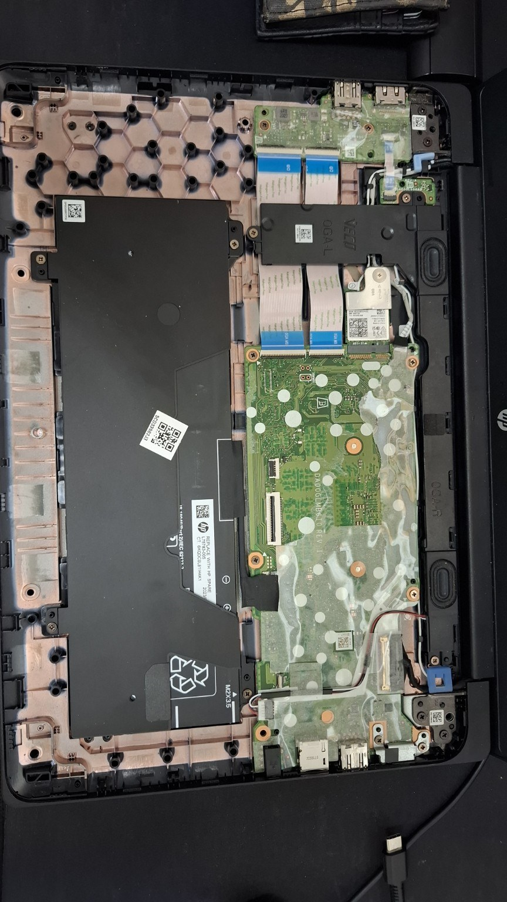
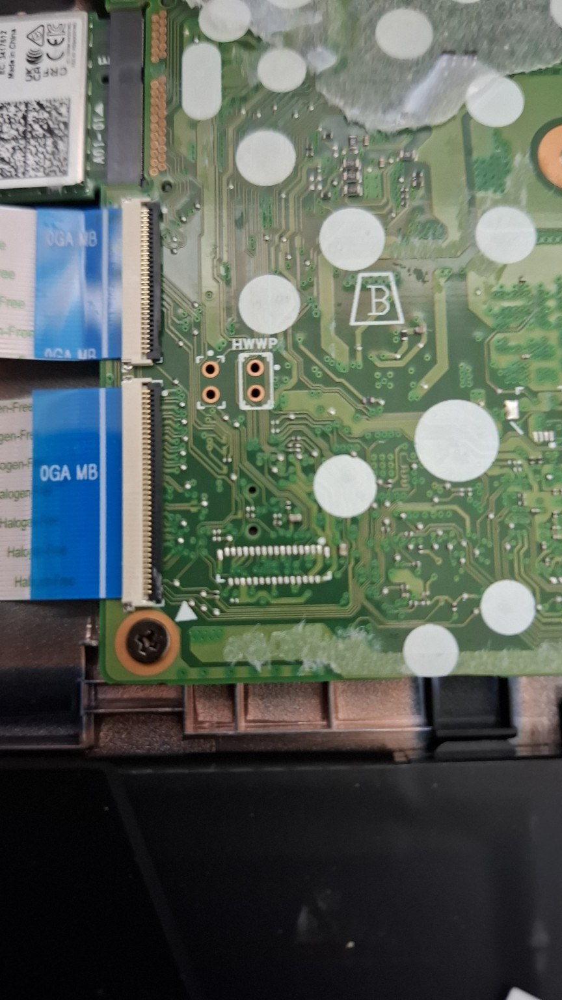
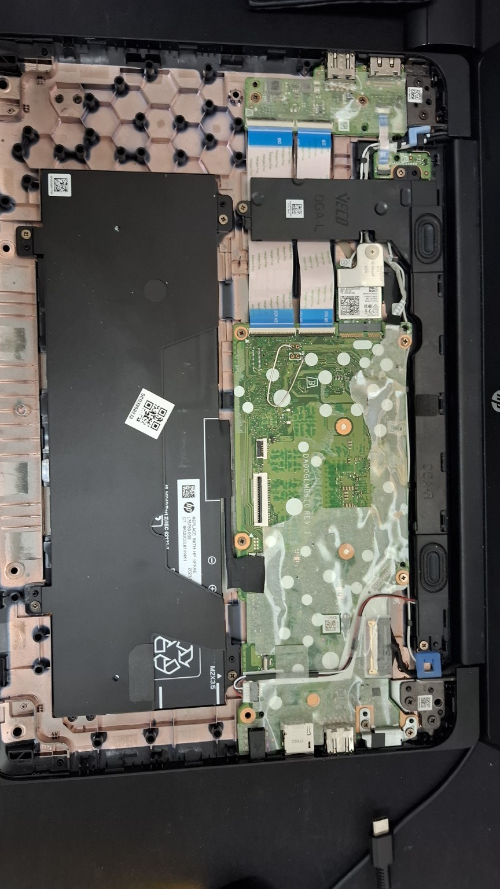
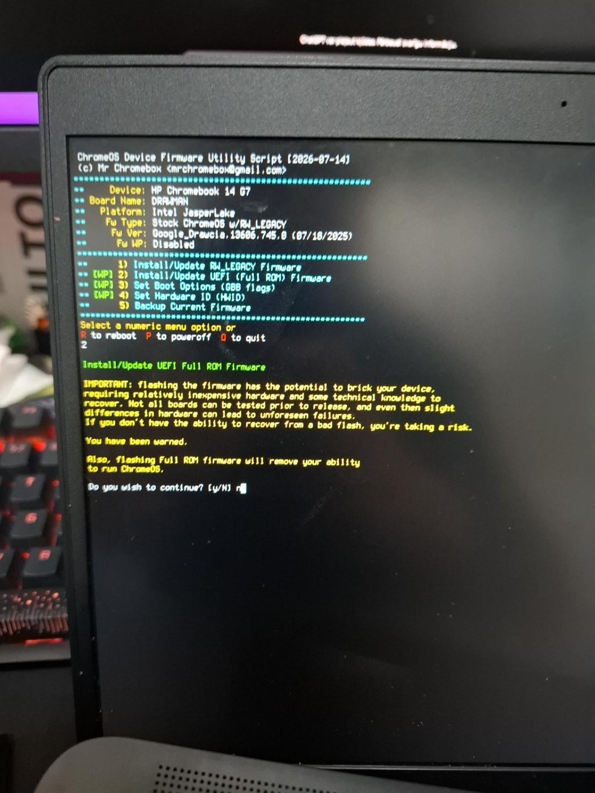
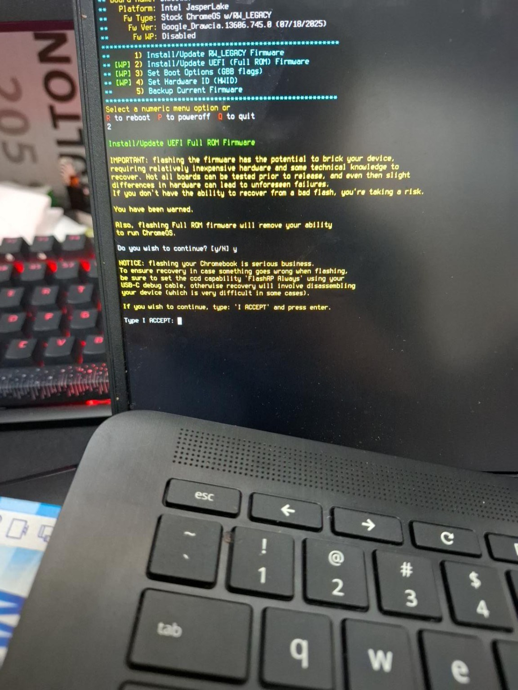
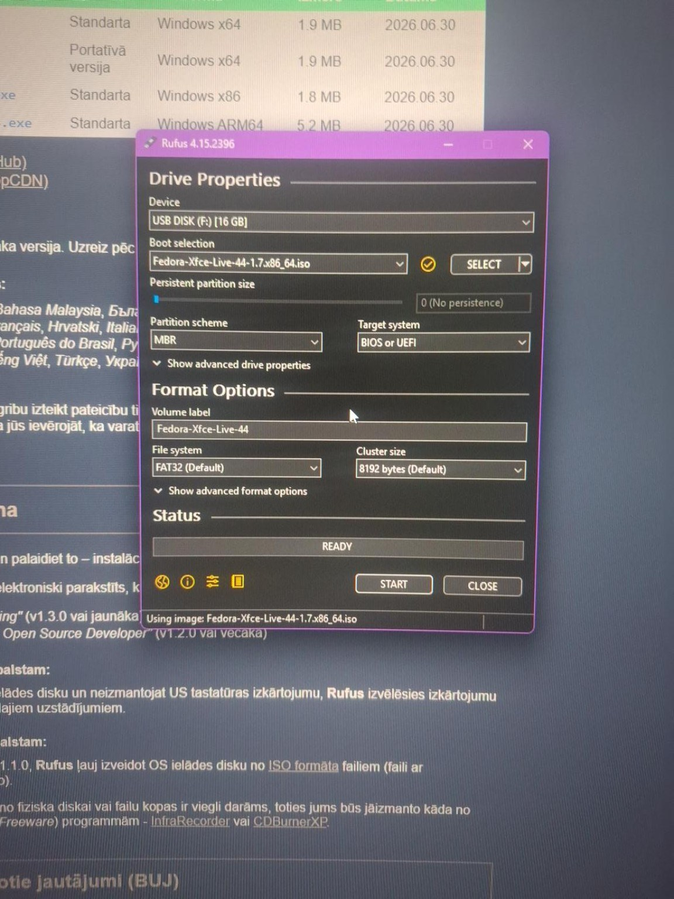
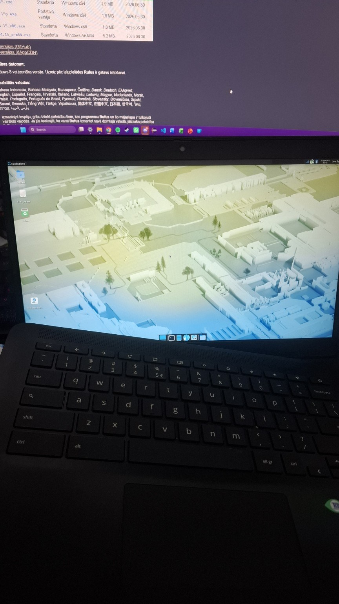
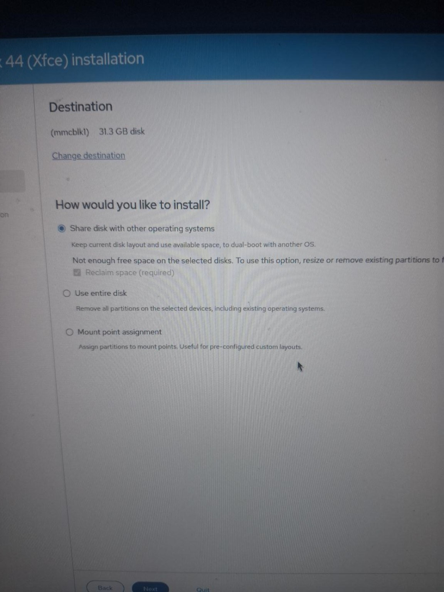
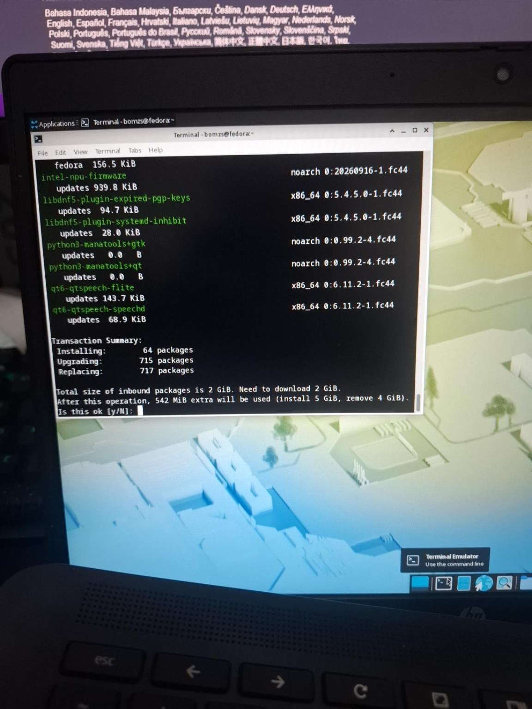

# HP Chromebook 14 G7 (DRAWMAN) → Fedora Linux

A model-specific, photo-assisted guide for **completely replacing ChromeOS** on an **HP Chromebook 14 G7** with **MrChromebox UEFI Full ROM firmware** and **Fedora Xfce**.

> **Tested setup:** HP Chromebook 14 G7, board/HWID `DRAWMAN-RHDN`, board revision 13, Intel Jasper Lake / `dedede` family, 32 GB eMMC.  
> **Tested Linux:** Fedora Xfce 44 x86_64.  
> **Guide last verified:** 2026-09-27.

This is an independent community guide. It is not affiliated with HP, Google, MrChromebox, Fedora, or the Chrultrabook project.

---

## ⚠️ Read this first

This procedure is destructive.

- Enabling ChromeOS Developer Mode wipes local ChromeOS user data.
- UEFI Full ROM **replaces the stock ChromeOS firmware**.
- Installing Fedora with **Use entire disk** deletes all ChromeOS partitions.
- A failed firmware flash can leave the Chromebook unable to boot.
- Bridging the wrong motherboard pads can damage the machine.
- **Do not bridge or move motherboard jumpers while the laptop is powered.**
- Back up the original firmware before flashing anything.

The official MrChromebox documentation should always take priority over this guide if anything has changed since this was written.

Useful official references:

- [MrChromebox — Supported Devices](https://docs.mrchromebox.tech/docs/supported-devices.html)
- [MrChromebox — Getting Started](https://docs.mrchromebox.tech/docs/getting-started)
- [MrChromebox — Developer Mode](https://docs.mrchromebox.tech/docs/boot-modes/developer.html)
- [MrChromebox — Disabling Firmware Write Protection](https://docs.mrchromebox.tech/docs/firmware/wp/disabling.html)
- [MrChromebox — Firmware Utility Script](https://docs.mrchromebox.tech/docs/fwscript)
- [MrChromebox — Booting Your OS](https://docs.mrchromebox.tech/docs/firmware/booting.html)
- [Chrultrabook — Installing Linux](https://docs.chrultrabook.com/docs/installing/installing-linux)
- [Fedora Xfce](https://fedoraproject.org/spins/xfce/download/)

---

## 1. Confirm that you really have DRAWMAN

MrChromebox support is determined by the **HWID / board name**, not just the marketing model number.

For this project the important identification was:

```text
HP Chromebook 14 G7
HWID: DRAWMAN-RHDN ...
Board: DRAWMAN
Board revision: 13
Platform family: dedede / Intel Jasper Lake
```

The tested machine's stock firmware happened to report a `Google_Drawcia...` firmware ID. That does **not** make it a DRAWCIA board. The hardware ID from `crossystem hwid` is what matters.

MrChromebox currently lists:

- **HP Chromebook 14 G7**
- **Board: DRAWMAN**
- **UEFI Full ROM: supported**
- **WP method: CR50 / SuzyQ or hardware jumper**

Do not use the jumper photos in this repository for a different board.

---

## 2. What you need

I recommend having all of this ready before beginning:

- HP Chromebook 14 G7 / DRAWMAN
- Charger
- Small Phillips screwdriver and plastic opening tool
- A temporary conductive bridge suitable for the WP jumper
- **USB #1** for the original firmware backup
- **USB #2** for the Fedora installer
- Another computer to create the Fedora USB
- Internet connection
- A backup of anything you care about from ChromeOS

Using two different USB drives reduces the chance of accidentally overwriting your firmware backup.

### Interior reference



---

## 3. Enable ChromeOS Developer Mode

> This wipes local ChromeOS user data.

1. Shut the Chromebook down.
2. Press **Esc + Refresh + Power** to enter Recovery Mode.
3. At the recovery screen, press **Ctrl + D**.
4. Confirm by pressing **Enter** when asked to disable OS verification / enable Developer Mode.
5. Let ChromeOS perform its wipe and reboot.
6. At the Developer Mode warning screen, press **Ctrl + D** to boot ChromeOS.

Do **not** enable the extra ChromeOS "debugging features" option. It is not needed for this process.

---

## 4. Open a root-capable VT2 shell

Modern ChromeOS versions no longer allow `sudo` from the normal crosh `shell`, so use VT2.

At the ChromeOS login screen:

1. Press **Ctrl + Alt + F2**. On most Chromebook keyboards F2 is the **Forward / right-arrow** top-row key.
2. Log in as:

```text
chronos
```

No password should be required.

Verify the hardware:

```bash
crossystem hwid
```

Expected beginning:

```text
DRAWMAN-
```

You can also check:

```bash
crossystem mainfw_type
```

In Developer Mode it should report `developer`.

---

## 5. Disable hardware firmware write protection

DRAWMAN is a CR50-era device and MrChromebox lists a **jumper** as a valid hardware write-protect method.

### Safety sequence

1. Shut the Chromebook down completely.
2. Disconnect the charger.
3. Remove the bottom cover.
4. Disconnect the internal battery from the motherboard.
5. Locate the **HWWP** jumper.
6. Bridge the correct pair.
7. Reconnect the battery.
8. Reassemble enough of the Chromebook to boot safely.
9. Boot back into ChromeOS Developer Mode.

If you are unsure how to open the machine or disconnect the battery, use HP's official **HP Chromebook 14 G7 Maintenance and Service Guide** from the [HP support page](https://support.hp.com/us-en/product/setup-user-guides/hp-chromebook-14-g7/38457196).

### Exact DRAWMAN HWWP location

This is the close-up from the tested machine:



The relevant jumper is the pair identified by the board's **HWWP** marking and by the DRAWMAN jumper image on the official MrChromebox supported-devices page. Do not guess based on nearby holes or test pads.

This photo shows the temporary bridge used on the tested machine:



**Do not leave a loose paperclip or wire where it can move and short other components.**

### Verify WP is actually off

Return to VT2 as `chronos` and run:

```bash
sudo gsctool -a -w
sudo gsctool -a -I
crossystem wpsw_cur
```

The wording from `gsctool` varies slightly by version, but you want the flash write-protect state to be disabled. Most importantly:

```text
crossystem wpsw_cur
```

should return:

```text
0
```

Do not proceed with Full ROM flashing if hardware WP is still active.

---

## 6. Back up the original firmware

This is one of the most important steps in the guide.

From the VT2 shell, run the official MrChromebox Firmware Utility Script:

```bash
cd; curl -LOf https://mrchromebox.tech/firmware-util.sh && sudo bash firmware-util.sh
```

The script detects the machine automatically.

On the tested machine it showed:



Before flashing Full ROM, I explicitly chose **Backup Current Firmware** and saved the resulting `.rom` file to a USB drive.

The menu number can change in future releases, so choose by **label**, not only by number.

Afterward:

- Confirm the `.rom` exists on the backup USB.
- Copy it to at least one other safe location.
- Do not use that USB as your Fedora installer unless the backup has already been copied elsewhere.

---

## 7. Flash MrChromebox UEFI Full ROM

In the Firmware Utility Script choose:

```text
Install/Update UEFI (Full ROM) Firmware
```

At the time of this project it was menu option 2.

The script gives a serious warning because a failed flash can require external recovery hardware. Read it.



If you understand the risk and have a verified firmware backup, follow the script's confirmation prompts.

### About the `FlashAP Always` / SuzyQ warning

The script may recommend setting CCD recovery capabilities such as `FlashAP` to `Always` using a SuzyQ debug cable. That provides a much easier recovery path after a bad flash.

It is not the same thing as the DRAWMAN hardware jumper requirement. If you do not have a SuzyQ cable, Full ROM flashing can still be done with the jumper method, but recovery from a bad flash may require reopening the machine and using external flashing hardware.

### During the flash

- Keep stable power connected.
- Do not shut down.
- Do not remove the jumper.
- If the script reports a flash failure, **DO NOT REBOOT**. Use the recovery/restore path while the machine is still running.

### After a successful flash

Return to the script's main menu and choose **Power Off**, not an immediate reboot.

Once the machine is fully off:

1. Disconnect external power.
2. Open the machine.
3. Remove the temporary HWWP bridge.
4. Make sure the battery and other connectors are properly seated.
5. Reassemble the Chromebook.

MrChromebox documents that after the initial UEFI Full ROM installation, future UEFI firmware updates do not require hardware WP to be disabled again unless you have manually re-enabled software protection.

At this point ChromeOS firmware is gone. The machine now behaves like a normal UEFI PC.

---

## 8. Download Fedora Xfce

For this project I used:

```text
Fedora Xfce 44
x86_64
```

Use the **x86_64** image for this Intel Jasper Lake Chromebook.

Official download:

https://fedoraproject.org/spins/xfce/download/

Chrultrabook currently recommends a modern Linux distribution and says supported setups should use a **Linux 6.19 or newer kernel**. Fedora is one of its recommended distributions.

---

## 9. Create the Fedora installer USB

### Recommended

Fedora Media Writer is the simplest Fedora-native method.

### Windows / Rufus

I used Rufus successfully during this project.



Important:

- The Fedora ISO should be stored on the **PC**, not only on the USB you are about to erase.
- Select the correct USB drive.
- Writing the image destroys the USB's existing contents.
- Never overwrite the USB that contains your only firmware backup.
- If Rufus asks how to write a Linux ISO, current MrChromebox documentation recommends **DD Image mode** for maximum compatibility.

When finished, safely eject the USB.

---

## 10. Boot Fedora from USB

1. Insert the Fedora installer USB.
2. Power on the Chromebook.
3. Press **Esc** when the coreboot/MrChromebox splash appears.
4. Open **Boot Menu** or **Boot Manager**.
5. Select the Fedora USB.

If you land at an EFI shell with a `Shell>` prompt:

```text
exit
```

Press Enter and choose the USB from the UEFI menu.

Once Fedora Xfce reaches the live desktop, test as much hardware as possible before installing:

- keyboard
- touchpad
- Wi-Fi
- display
- brightness controls
- USB ports



---

## 11. Install Fedora and erase ChromeOS

Launch the Fedora installer.

On the tested 32 GB model, the internal eMMC appeared as:

```text
mmcblk1
31.3 GB
```

**Do not assume your device will use the same Linux device name.** Verify by capacity and by confirming which drive is the internal eMMC rather than your USB installer.

A useful check from a terminal is:

```bash
lsblk -o NAME,SIZE,MODEL,RM,TYPE,MOUNTPOINTS
```

Because this project intentionally removes ChromeOS completely, choose:

```text
Use entire disk
```



This deletes the existing ChromeOS partition layout and lets Fedora create a normal Linux/UEFI layout.

### Disk encryption

For a laptop, enabling full-disk encryption is a good option if you are comfortable entering an unlock passphrase at boot.

If you lose the encryption passphrase, the data cannot realistically be recovered.

### Root account

For a normal Fedora laptop:

- Leave direct **root account login disabled**.
- Create your regular account as an administrator.
- Use `sudo` when administrative access is needed.

Finish the installation.

When the installer is done:

1. Shut down/reboot as instructed.
2. Remove the Fedora installer USB.
3. Boot from the internal eMMC.

---

## 12. First boot and updates

Connect to Wi-Fi, open a terminal and update the system:

```bash
sudo dnf upgrade --refresh
```

Then reboot:

```bash
sudo reboot
```

The first update on my install was large:



After rebooting, check the running kernel:

```bash
uname -r
```

For current Chrultrabook support, use kernel **6.19 or newer**.

---

## 13. Fixing internal audio

Audio is a common exception on converted Chromebooks. On the tested DRAWMAN machine, Fedora installed successfully but the internal audio did not work out of the box.

Chrultrabook currently recommends the `chromebook-linux-audio` project.

Install Git first:

```bash
sudo dnf install -y git
```

Then:

```bash
git clone --depth 1 https://github.com/WeirdTreeThing/chromebook-linux-audio
cd chromebook-linux-audio
./setup-audio
```

When it finishes:

```bash
sudo reboot
```

### Fedora 44 note

As of 2026-09-27, the audio project's README explicitly lists **Fedora 43** among its officially supported distributions, not Fedora 44. Fedora 44 may still work, but treat it as a current-version compatibility edge case rather than a guarantee.

The script itself recognizes the `google_dedede` platform as Intel Jasper Lake.

If audio still does not appear after reboot, collect:

```bash
cat /proc/asound/cards
wpctl status
uname -r
```

Also check your PipeWire/PulseAudio profile. Some Jasper Lake users have found the device present but its profile set to **Off**; switching it to **Pro Audio** can help in that specific situation.

Do not use random AVS/codec force options without understanding the hardware. The Chrultrabook documentation specifically warns that the wrong audio-driver path can damage speakers on some Chromebook configurations.

---

## 14. Useful troubleshooting

### `shell` says "unknown command"

Developer Mode is probably not enabled yet.

### `sudo` does not work in crosh

That is expected on modern ChromeOS. Use the VT2 shell:

```text
Ctrl + Alt + F2
login: chronos
```

### The UEFI firmware opens an EFI shell

Type:

```text
exit
```

Then use Boot Menu / Boot Manager.

### USB installer is not detected

- Remove and reinsert it in the UEFI menu.
- Try another USB port.
- Try another USB stick.
- Re-create the installer as a raw/DD image.

### Firmware flash reports an error

Do **not** reboot. Restore/retry while the machine is still running.

### Fedora installed but UEFI cannot find it

Use the UEFI **Boot Manager → Boot From File** option to locate Fedora's EFI loader. The current MrChromebox boot documentation has the recovery procedure if an EFI boot entry is missing.

---

## 15. Returning to ChromeOS later

Keep the original `.rom` firmware backup.

MrChromebox currently documents restoration from Linux by running the Firmware Utility Script again and choosing **Restore Stock Firmware**, then performing a ChromeOS USB recovery.

Use the current restoration documentation rather than relying on an old command sequence:

https://docs.mrchromebox.tech/docs/reverting/flashing-stock.html

Note that MrChromebox may block stock restoration after a device reaches ChromeOS AUE/EOL.

---

## Photo selection

The repository intentionally uses only photos that add unique instructional value:

| File | Why it is included |
|---|---|
| `01-internals-overview.jpg` | Shows the overall motherboard/battery layout |
| `02-hwwp-jumper-pads.jpg` | Best close-up of the DRAWMAN HWWP area |
| `03-hwwp-jumper-bridged.jpg` | Shows the temporary jumper in context |
| `04-mrchromebox-firmware-menu.jpg` | Confirms DRAWMAN detection, Jasper Lake and WP-disabled state |
| `05-full-rom-confirmation.jpg` | Shows the serious Full ROM confirmation stage |
| `06-rufus-fedora-usb.jpg` | Shows the Fedora Xfce x86_64 ISO selected in Rufus |
| `07-fedora-install-entire-disk.jpg` | Shows the destructive full-disk install choice |
| `08-fedora-xfce-live.jpg` | Confirms successful Fedora live boot |
| `09-fedora-postinstall-update.jpg` | Shows the first post-install update step |

I left out the extra connector close-ups, duplicate installer-progress shots, and the low-angle open-chassis photo because they either repeat information or could cause readers to mistake an unrelated connector for the write-protect hardware.

---

## Sources / further reading

- MrChromebox Supported Devices  
  https://docs.mrchromebox.tech/docs/supported-devices.html
- MrChromebox Developer Mode  
  https://docs.mrchromebox.tech/docs/boot-modes/developer.html
- MrChromebox Firmware Write Protection  
  https://docs.mrchromebox.tech/docs/firmware/wp/disabling.html
- MrChromebox Firmware Utility Script  
  https://docs.mrchromebox.tech/docs/fwscript
- MrChromebox Booting Your OS  
  https://docs.mrchromebox.tech/docs/firmware/booting.html
- MrChromebox Restore Stock Firmware  
  https://docs.mrchromebox.tech/docs/reverting/flashing-stock.html
- Chrultrabook Installing Linux  
  https://docs.chrultrabook.com/docs/installing/installing-linux
- Chromebook Linux Audio  
  https://github.com/WeirdTreeThing/chromebook-linux-audio
- Fedora Xfce  
  https://fedoraproject.org/spins/xfce/download/
- HP Chromebook 14 G7 support/manuals  
  https://support.hp.com/us-en/product/setup-user-guides/hp-chromebook-14-g7/38457196

---

## Repository topics

Suggested GitHub topics:

```text
chromebook
hp-chromebook
hp-chromebook-14-g7
drawman
jasper-lake
linux
fedora
xfce
mrchromebox
coreboot
uefi
chrultrabook
```
